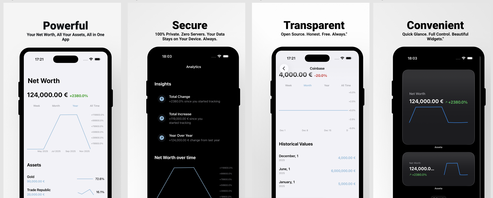

# Asseta - Track and Analyse your net worth 

Asseta is a beautiful and privacy-focused net worth tracking app that helps you monitor your financial growth over time.

## Features

### 💰 Asset Tracking
- Track unlimited assets with custom names
- Automatically calculate total net worth across all assets
- Record value changes over time to visualize your financial journey

### 📊 Analytics & Insights
- **Interactive Charts** - Beautiful visualizations showing your net worth trends
- **Detailed Analytics** - Get insights on your growth including:
  - Total change since you started tracking
  - Year-over-year comparisons
  - Average yearly growth rates

### 🏠 Home Screen Widget
- View your net worth at a glance without opening the app
- Beautiful widget design that fits seamlessly on your home screen

### 🌍 Multi-Currency Support
- Track in 15+ currencies including USD, EUR, GBP, JPY, and more
- Switch between currencies effortlessly

### 🔒 Privacy First
- All data is stored locally on your device
- Never transmitted to servers
- Complete privacy and offline functionality
- Anonymize mode - Hide actual values while still seeing trends and percentages

### ✨ Clean Interface
- Modern, intuitive design
- Makes tracking your finances effortless

## Perfect For

- 👤 Monitoring investment portfolio growth
- 🏡 Tracking real estate values
- 💵 Following savings account balances
- 📈 Visualizing overall financial progress

## Privacy

Your financial data is yours and yours alone. Asseta stores everything locally using iOS's secure storage (SwiftData), ensuring complete privacy and offline functionality. No data is collected, transmitted, or shared.

For more details, see our [Privacy Policy](PRIVACY_POLICY.md).

## Requirements

- iOS 17.0 or later
- iPhone or iPad

## Installation

Asseta is available on the App Store.

[Download on the App Store](https://apps.apple.com/app/asseta) *(Link coming soon)*

## Development

Built with:
- **SwiftUI** - Modern declarative UI framework
- **SwiftData** - Local data persistence
- **WidgetKit** - Home screen widget support
- **Charts** - Beautiful data visualizations

## License

See [LICENSE](LICENSE) file for details.

## Support

For support, questions, or feedback:
- 📧 Email: mi.apps.requests@gmail.com
- 📖 [Support Documentation](SUPPORT.md) - FAQ, troubleshooting, and getting started guide
- 🔒 [Privacy Policy](PRIVACY_POLICY.md) - Learn how we protect your data

**© 2025 Steven Mi. All rights reserved.**
